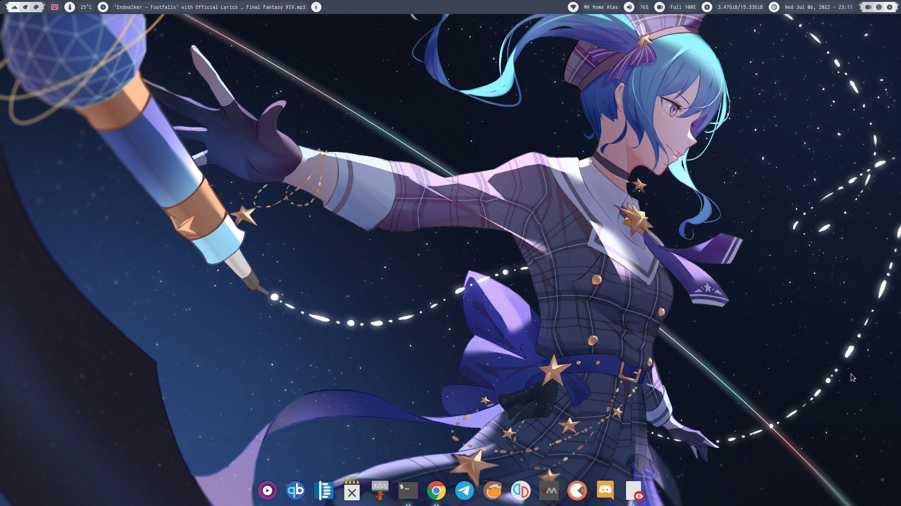

# Dotfile

This is a WIP

## Setup

- **Distro** : Arch Linux
- **WM** : awesome wm, dwm
- **status bar** : wibar
- **Shell** : zsh
- **File Manager** : vifm
- **Terminal** : st
- **Editor** : nvim (nightly)

## Screenshot




## Download

```
alias config="/usr/bin/git --git-dir $HOME/.cfg/ --work-tree=$HOME"
git clone --bare https://www.github.com/mkadit/dotfile.git $HOME/.cfg
config checkout
config config --local status.showUntrackedFiles no
```

## Packages

Use the AUR for this to make life easier

```
abook
alsa-utils
atool
awesome-git
base-devel
bat
bluez
brightnessctl
btop
clipmenu
cronie
curl
dmenu
dosfstools
downgrade
dunst
exfat-utils
exiv2
fctix5
fctix5-gtk
fctix5-qt
fctix5-configtool
fctix5-mozc
fctix5-nord
fd
ffmpeg
fzf
git
gnome-keyring
gnupg
htop
imagemagick
isync
jq
libnotify
lxsession
man-db
mediainfo
mpc
mpd
mpv
msmtp
mutt-wizard
ncmpcpp
neofetch
neomutt
neovim-nightly-git
newsboat
nerd-fonts-jetbrains-mono
nmdu
nordic-theme
notmuch
ntfs-3g
openssh
pamac-all
pamixer
papirus-nord
pass
pavucontrol
picom
playerctl
poppler
pulseaudio
pulseaudio-alsa
qutebrowser
rclone
ripgrep
rmlint
rofi
simple-mtpfs
slimlock
slop
sxiv
thunar
tmux
ueberzug
unclutter
unrar
unzip
urlview
vieb
vifm
xclip
xdotool
xorg-server
xorg-xbacklight
xorg-xdpyinfo
xorg-xinit
xorg-xprop
xorg-xsetroot
xorg-xwinfo
xwallpaper
yt-dlp-git
yt-dlp-drop-in
zathura
zathura-pdf-mupdf
zsh
zsh-autocomplete-git
zsh-fast-syntax-highlighting
```

## Optional

Below package are optional

If you are planning to use openbox
```
obmenu-generator
openbox
plank
tint2
gsimplecal
```

programming stuff
```
autopep8
docker
docker-compose
lxpolkit
postgresql
prettierd
shellcheck
shfmt
stylua
xwinwrap-git
```

zsh auto complete alternative (do note you'll need change .zshrc)
```
zsh-autosuggestions
zsh-completion
```

## After

```
chsh -s $(which zsh)
fc-cache -rv
sudo chmod u+s $(command -v brightnessctl)
```

## Suckless Builds

- [dwm](https://github.com/mkadit/dwm)
- [st](https://github.com/mkadit/st)

### Useful keybindings (maybe)

- [awesome wm keybindings](.config/awesome/utils/keybind.lua)
- [zsh keybindings](.config/zsh/key-bindings.zsh)

## FAQ

Q: Why is there no wallpaper?

A: My config use xwallpaper to set the background using the file located ~/.local/share/bg. In order to address
this you can use the script `setbg` on a wallpaper of your chosing and all should be well. You could also use
<kbd>Ctrl</kbd> + <kbd>x</kbd>, <kbd>Ctrl</kbd> + <kbd>w</kbd> when using sxiv to use the selected wallpaper

Q: Neovim is not working as intended

A: Make sure you use the latest version (nightly) and not the stable one since there are many plugins unavailable on the stable branch. Make ure you already have the necessary LSP in ~/.local/share/nvim/lspinstall as the
configuration for the LSP is set to point to there.
